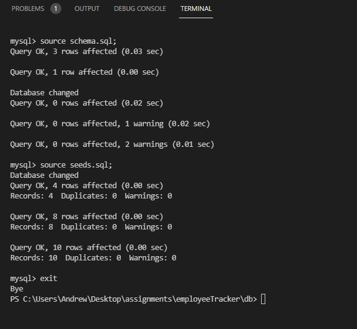
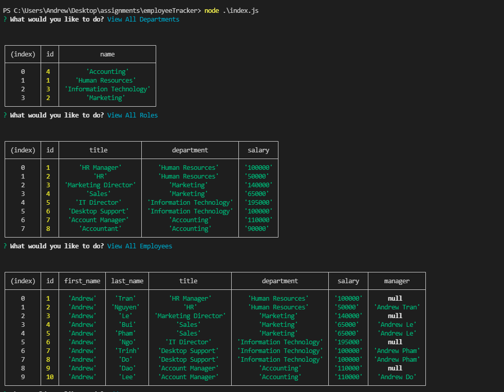
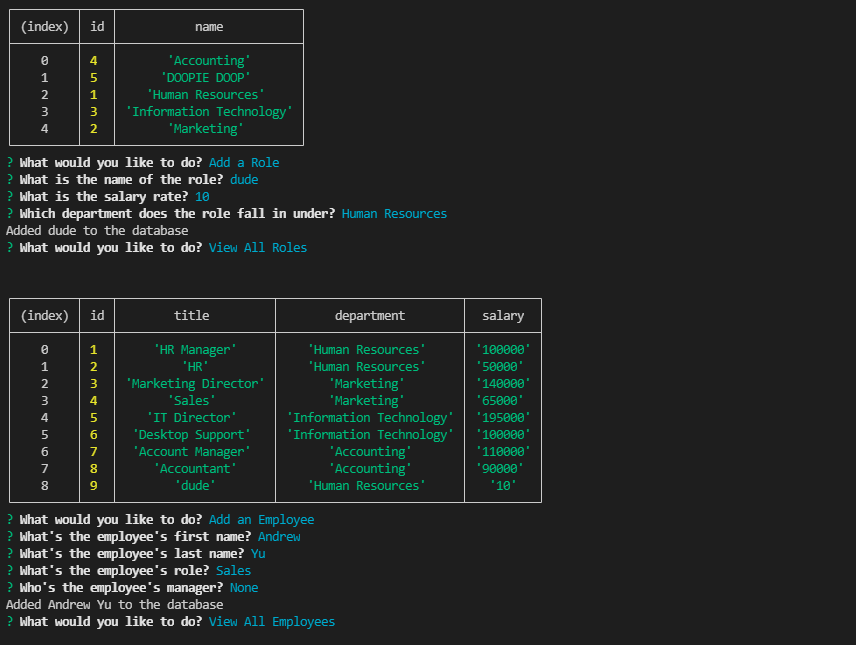
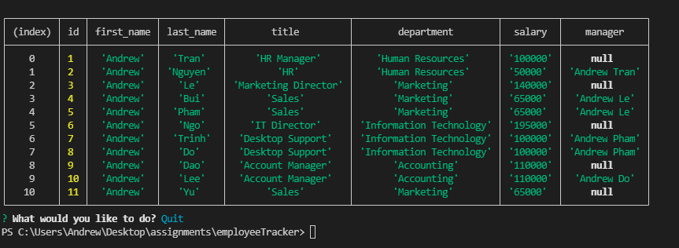

# Emmployee Tracker

### Github : https://github.com/AndrewTranMSW/expressNoteTaker

### Deployed Application (Heroku) : https://secret-temple-21796.herokuapp.com/


### Walkthrough video : https://youtu.be/d9a3sLy97JY


<br>

## Description
Command-line application to manage an organization's employee database, using Node.js, Inquirer, and MySQL.


## User Story
```
- AS A business owner
- I WANT to be able to view and manage the departments, roles, and employees in my company
- SO THAT I can organize and plan my business
```

## Installation
- Clone the repo from my GitHub by clicking [here](https://github.com/AndrewTranMSW/employeeTracker). You can also click here to win [money](https://www.youtube.com/watch?v=dQw4w9WgXcQ).
- Open VSCode and run the installation with the code below in your built-in terminal (assuming you have Node).
```
npm install
```
- Then run this command in your mysql terminal:
```
source schema.sql;
```
- and then:
```
source seeds.sql;
```
- and then:
```
exit
```
- Then run this command in the index.js terminal at the root to run this application:
```
node index.js
```

## Usage
- Application will allow user to view all departments.
- Application will allow user to view all roles.
- Application will allow user to view all employees.
- Application will allow user to add a department.
- Application will allow user to add a role.
- Application will allow user to add an employee.
- Application will allow user to update an employee role.


## Functionality











## Technologies Used
<p><a href="https://nodejs.org/">Node.js</a></p>
<p><a href="https://www.npmjs.com/">NPM</a></p>
<p><a href="https://www.npmjs.com/package/express">Express.js</a></p>
<p><a href="https://www.npmjs.com/package/inquirer">Inquirer.js</a></p>
<p><a href="https://dev.mysql.com">MySQL</a></p>
<p><a href="https://www.npmjs.com/package/mysql2">Node MySQL 2</a></p>

## Credits
- https://dev.mysql.com/doc/refman/8.0/en/


## Contributor:
<u>Andrew Tran</u>
<br>
- Github: (https://github.com/andrewtranMSW)
- E-mail address: andrewtranmsw@gmail.com
- - -